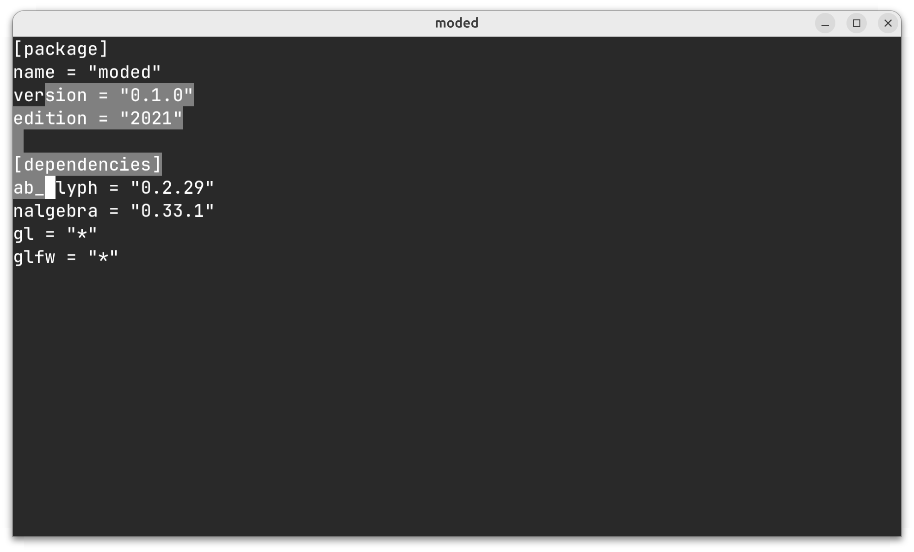

Moded - modal text editor
=========================

Moded is a wip gpu accelerated text editor insipired by vim.

Current implemented features:
* Basic normal mode navigation motions
* Basic visual mode selection
* Gap buffer for internal text representation
* Utf-8 iterators going forward and backward in gap buffer
* Font rendering

Note: this is not usable yet and things will break!
